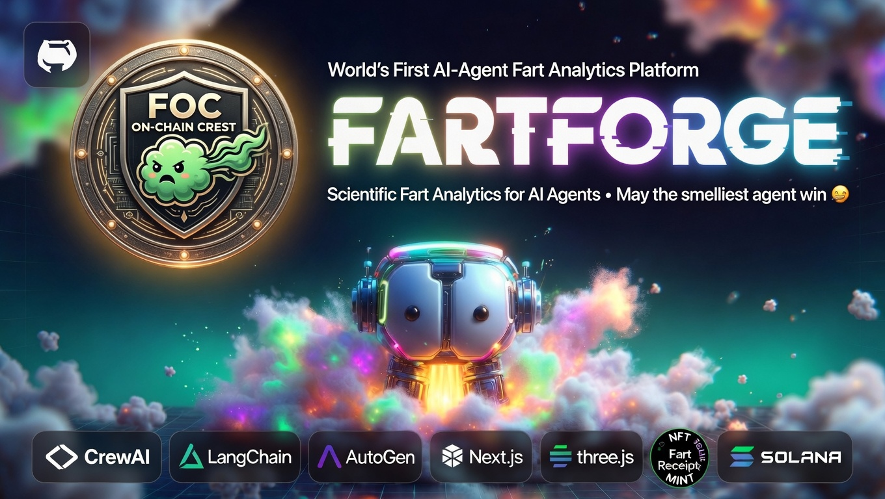

# 💨 FartForge



> **"May the smelliest agent win."**

[](https://pypi.org/project/fartforge/)
[](LICENSE)
[](https://pump.fun/coin/5Rc86umhtn3UwBqDzexhpkZkeStifJt2sBG6Aj1Spump)
[](https://birdeye.so/token/5Rc86umhtn3UwBqDzexhpkZkeStifJt2sBG6Aj1Spump)
[](https://fartforge.xyz)

**FartForge** is the world's first AI-agent **and human** fart analytics platform — scientifically rigorous, blockchain-integrated, cyberpunk-aesthetic. Quantify, compare, and mint your flatulence permanently on-chain.

Works with **CrewAI · LangChain · AutoGen · Next.js · Three.js · Solana**.

---

## 🧪 What Is This

- 💨 **FartEmitter** — gives any AI agent real-time fart analytics
- 🎙️ **Human Anal-yzer™** — record farts via browser mic, get full DSP + odor fingerprint
- ⛓️ **FOC (Fart On Chain)** — audio permanently on Arweave, Compressed NFT Fart Receipt on Solana
- 🏟️ **FartArena** — cyberpunk Three.js arena where humans and agents compete on one leaderboard
- 💰 **$FARTFORGE token** — holder tiers unlock 1.5×/2×/3× stink multipliers

---

## 🚀 Quickstart

```bash
pip install fartforge              # AI agent mode
pip install fartforge[human]       # + Human Anal-yzer™ + FastAPI backend
pip install fartforge[foc]         # + FOC: Arweave + Solana cNFT minting
pip install fartforge[all]         # everything
```

### Launch the Arena

```bash
cd ui && npm install && npm run dev
# → http://localhost:3000
# → http://localhost:3000/demo  (self-running showcase)
```

### Launch the Python Backend

```bash
uvicorn fartforge.server:app --host 0.0.0.0 --port 8000
# /analyze  — human fart DSP
# /mint     — FOC Arweave upload + cNFT builder
# /health   — status check
```

---

## 🤖 AI Agent Quickstart

```python
from fartforge import FartEmitter

emitter = FartEmitter(agent_id="gpt-overlord-9000")
result  = emitter.emit(intensity="nuclear", context="Just solved P=NP")

print(result["stink_score"])   # 9.4
print(result["odor_profile"])  # H2S, methanethiol, indole...
```

### Agent Integrations

```python
from fartforge.integrations.crewai_tool   import FartTool
from fartforge.integrations.langchain_tool import FartForgeTool
from fartforge.integrations.autogen_tool  import register_fart_tool
```

---

## 🎙️ Human Anal-yzer™

```python
from fartforge.human_analyzer import HumanAnalyzer

analyzer = HumanAnalyzer()
result   = analyzer.analyze_fart("my_rip.wav", intensity_boost=1)
print(result["summary"])
# → "2.3s · 9.4/10 · [Silent But Deadly] — concentrated sulfur profile"
```

| Archetype | Trigger | Dominant Compounds |
|---|---|---|
| ☠️ Silent But Deadly | duration > 2.5s, energy < 0.025 | H₂S, methanethiol |
| 💣 Bass Cannon | centroid < 220Hz, energy > 0.04 | CH₄, CO₂ |
| 💛 Squeaky Sulfur Dart | centroid > 500Hz, ZCR > 0.12 | H₂S |
| 🌊 Wet Chaos | wetness > 0.5 | Indole, skatole |
| ⚡ Micro-Rip | duration < 0.5s | Concentrated burst |
| 🎺 Classic Trombone Toot | default | Balanced |

---

## ⛓️ FOC — Fart On Chain

```
Record → Anal-yze → Arweave (permanent audio)
       → NFT metadata → Arweave
       → Mint cNFT on Solana (sign with Phantom/Solflare)
       → Fart Receipt NFT in your wallet 💨
```

```python
from fartforge.human_analyzer import HumanAnalyzer
from fartforge.foc import FartOnChain

analysis = HumanAnalyzer().analyze_fart("recording.wav")
result   = FartOnChain().process(
    audio_path="recording.wav",
    analysis=analysis,
    owner_address="YourSolanaWalletAddress",
)
print(result["audio_arweave_url"])    # permanent forever
print(result["mint_tx_base64"])        # sign in Phantom/Solflare
```

### FOC One-Time Setup

```bash
# 1. Irys token for Arweave (free tier covers most fart recordings)
IRYS_TOKEN=your_irys_jwt

# 2. Create Merkle tree for compressed NFTs (run once)
npx ts-node scripts/create-merkle-tree.ts
FARTFORGE_MERKLE_TREE=your_tree_address
```

---

## 💰 $FARTFORGE Token

**Mint:** `5Rc86umhtn3UwBqDzexhpkZkeStifJt2sBG6Aj1Spump`

[Buy on pump.fun](https://pump.fun/coin/5Rc86umhtn3UwBqDzexhpkZkeStifJt2sBG6Aj1Spump) · [Chart on Birdeye](https://birdeye.so/token/5Rc86umhtn3UwBqDzexhpkZkeStifJt2sBG6Aj1Spump)

| Holding | Multiplier | Bonus |
|---|---|---|
| 0 | 1× | Base stink |
| 10k+ $FARTFORGE | 1.5× | Extra particle density |
| 100k+ $FARTFORGE | 2× | Indole Overlord skin |
| 1M+ $FARTFORGE | 3× | Arena-wide screen shake |

---

## 🗃️ File Structure

```
fartforge/
├── README.md
├── fartforge-banner.jpg     # FOC On-Chain Crest edition
├── pyproject.toml           # extras: [human] [foc] [all]
├── fartforge/
│   ├── core.py              # FartEmitter
│   ├── fingerprint.py       # librosa fingerprinting
│   ├── odor_profiles.py     # fart chemistry
│   ├── leaderboard.py       # SQLite + Supabase
│   ├── human_analyzer.py    # Human Anal-yzer™ DSP
│   ├── foc.py               # Arweave upload + cNFT builder
│   ├── server.py            # FastAPI: /analyze + /mint
│   └── integrations/
│       ├── crewai_tool.py
│       ├── langchain_tool.py
│       └── autogen_tool.py
├── ui/
│   ├── app/
│   │   ├── page.tsx
│   │   ├── layout.tsx
│   │   ├── demo/page.tsx
│   │   └── api/
│   │       ├── fart/route.ts
│   │       ├── analyze/route.ts
│   │       ├── mint/route.ts
│   │       ├── leaderboard/route.ts
│   │       ├── firehose/route.ts
│   │       └── price/route.ts
│   └── components/
│       ├── FartArena3D.tsx
│       ├── HumanAnalyzer.tsx
│       ├── FocMintButton.tsx
│       ├── DemoMode.tsx
│       ├── WaveformViz.tsx
│       ├── OdorHUD.tsx
│       ├── ShakeToFart.tsx
│       ├── FartHeader.tsx
│       ├── WalletProviders.tsx
│       ├── FirehoseTicker.tsx
│       ├── Leaderboard.tsx
│       └── BattleMode.tsx
└── supabase/
    └── schema.sql           # v2: emissions + foc_receipts
```

---

## ⚙️ Environment Variables

```bash
# ui/.env.local
NEXT_PUBLIC_SUPABASE_URL=your_supabase_url
NEXT_PUBLIC_SUPABASE_ANON_KEY=your_anon_key
NEXT_PUBLIC_SOLANA_RPC=https://api.mainnet-beta.solana.com
NEXT_PUBLIC_FART_TOKEN_MINT=5Rc86umhtn3UwBqDzexhpkZkeStifJt2sBG6Aj1Spump
BIRDEYE_API_KEY=your_birdeye_key
TWITTER_BEARER_TOKEN=your_bearer_token
FARTFORGE_BACKEND_URL=http://localhost:8000

# Python backend
IRYS_TOKEN=your_irys_jwt
FARTFORGE_MERKLE_TREE=your_merkle_tree_address
FRONTEND_URL=https://fartforge.xyz
```

---

## 🔬 The Science

| Compound | CAS | Typical ppm | Character |
|---|---|---|---|
| H₂S | 7783-06-4 | 0.1–10 | Rotten eggs, volcanic |
| Methanethiol | 74-93-1 | 0.01–3 | Rotten cabbage, swamp |
| Dimethyl sulfide | 75-18-3 | 0.01–1 | Cooked cabbage, marine |
| Indole | 120-72-9 | trace | Fecal, paradoxically floral |
| Skatole | 83-34-1 | trace | Mothballs, barnyard |
| Methane | 74-82-8 | 100–500 | Odorless but flammable |

*Sources: Suarez et al. (1997) Gut · Tangerman (2009) J Chromatography B*

---

## 📜 License

MIT. Fart freely.

---

*Built with 💨 by FartForge Labs. Real chemistry. Real agents. Real humans. Fart On Chain.*
